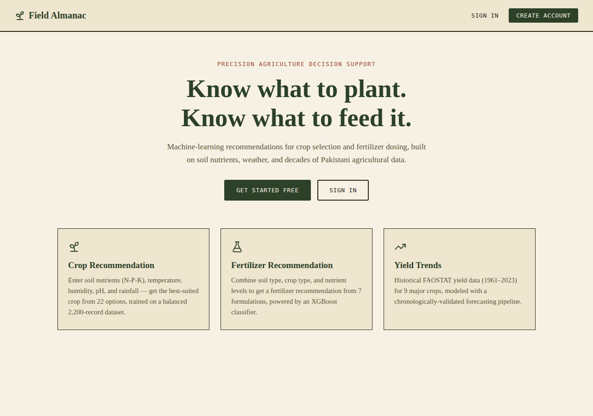
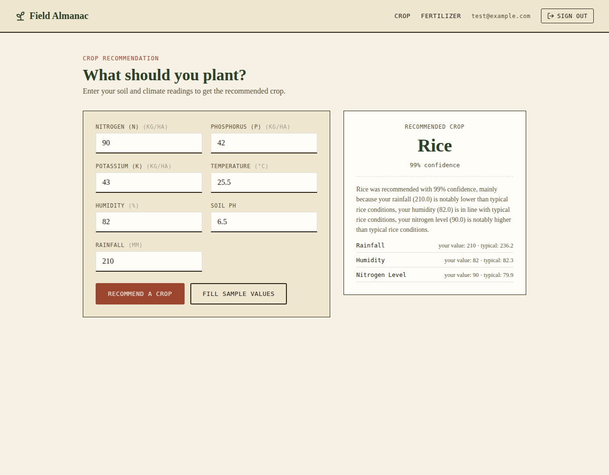
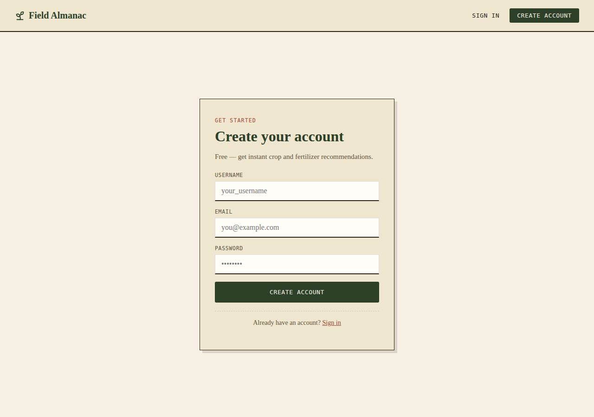
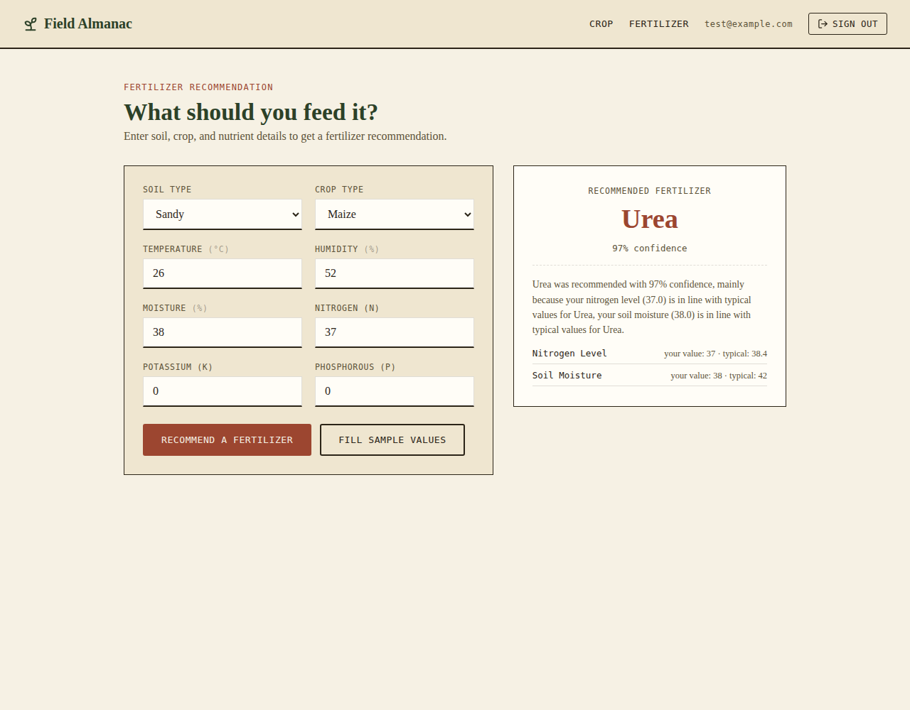

# 🌾 Field Almanac — Precision Agriculture Decision Support System

An intelligent, ML-based decision support system for Pakistani farmers:
**crop recommendation**, **fertilizer recommendation**, and **yield
forecasting**, backed by a Flask + PostgreSQL API and a React frontend.

---

## 📸 Screenshots

| Home | Crop Recommendation |
|---|---|
|  |  |

| Create Account | Fertilizer Recommendation |
|---|---|
|  |  |

---

## 📁 Project Structure

```
ML_Project/
├── src/                          # Flask backend
│   ├── app.py                    # app factory, blueprint registration, CORS
│   ├── config.py                 # env-based configuration
│   ├── database.py                # SQLAlchemy instance
│   ├── init_db.py                # ⭐ creates all DB tables (run once)
│   ├── models/                   # SQLAlchemy models (User, Crop, Fertilizer, ...)
│   ├── routes/                   # auth, crop, fertilizer blueprints
│   └── utils/                    # JWT middleware, model loader
├── frontend/                     # ⭐ React app (new)
│   ├── src/
│   │   ├── pages/                # Home, Login, Register, Crop, Fertilizer
│   │   ├── components/           # Navbar, ProtectedRoute
│   │   ├── context/AuthContext.jsx
│   │   └── api/client.js         # axios client with JWT interceptor
│   └── package.json
├── notebooks/
│   ├── 01_Data_Understanding.ipynb
│   ├── 02_Crop_Recommendation_EDA.ipynb
│   ├── 02_Fertilizer_Recommendation.ipynb
│   ├── 03_Feature_Engineering_Preprocessing.ipynb   # crop model training
│   ├── yield_prediction_model.ipynb                 # ⭐ rewritten, see below
│   └── requirements-notebooks.txt
├── models/                       # saved .pkl artifacts (all models + encoders)
├── data/raw/                     # source CSVs
├── docs/screenshots/             # ⭐ used in this README
├── requirements.txt               # ⭐ cleaned, backend-only dependencies
├── .env.example                  # ⭐ template — copy to .env and fill in
└── .gitignore                    # ⭐ fixed — now actually excludes .env
```

---

## 🔒 Security fixes (read this first)

The original project had **no `.gitignore` entries** and a real `.env` file
with a live database password and JWT/session secret keys. If this had been
pushed to a public GitHub repo, those credentials would be exposed to
anyone.

**What was fixed:**
- `.gitignore` now excludes `.env`, `venv/`, `node_modules/`, and other
  local-only files.
- `.env.example` was added as a safe template — copy it to `.env` and fill
  in your own values.

**What you should still do:**
- If your original `.env` was ever committed or pushed anywhere (GitHub,
  a shared drive, etc.), **rotate the credentials** — change your
  PostgreSQL password and generate new `SECRET_KEY` / `JWT_SECRET_KEY`
  values before deploying.

---

## 🐛 Flaws found and fixed in the notebooks

### 1. Broken label encoder in `03_Feature_Engineering_Preprocessing.ipynb` (critical)

The saved `crop_label_encoder.pkl` was **completely broken** — it could not
convert model predictions back into crop names. The notebook created a
LabelEncoder (`encoder`), correctly fit it on the crop names, then later
created a **second** LabelEncoder (`le`) and accidentally fit it on data
that was *already* integer-encoded — turning `[0,1,2,...,21]` into
`[0,1,2,...,21]` again (a no-op). That broken second encoder is what got
saved. This is why `routes/crop.py` had a hardcoded manual dictionary
mapping numbers to crop names instead of using the saved encoder — it was a
workaround for this bug, not a design choice.

**Fixed:** the notebook now reuses the correct encoder, the artifact was
regenerated, and `routes/crop.py` now calls
`crop_label_encoder.inverse_transform(...)` directly instead of the manual
dictionary — one source of truth instead of two that can drift apart.

### 2. Temporal data leakage in `yield_prediction_model.ipynb` (critical)

The original notebook used a **random** `train_test_split` on **time-series**
yield data (year-by-year, 1961–2023). That lets the model see future years
during training and get evaluated on past years — inflating the reported R²
and making it useless as an actual forecasting model.

**Fixed:** the notebook now uses a **chronological split** (train on years
≤2018, test on 2019–2023), adds a realistic **lag feature** (previous
year's yield), compares 3 models instead of 1, and actually **saves the
trained model** (the original never persisted an artifact).

### 3. Case-sensitive filename bug (portability)

Several notebooks referenced `crop_recommendation.csv` (lowercase), but the
actual file is `Crop_recommendation.csv` (capital C). This works on Windows
(case-insensitive filesystem) but **crashes on Linux** — which matters the
moment you deploy to any Linux-based server or CI pipeline. Fixed across all
affected notebooks.

### 4. Relative path bug when saving the crop model

`03_Feature_Engineering_Preprocessing.ipynb` saved the final model to
`"models/crop_recommendation_model.pkl"` (relative to whatever directory
Jupyter happened to be launched from) instead of `"../models/..."` like
every other notebook in the project. Fixed for consistency.

### 5. Small-dataset caveat added to the fertilizer notebook

The fertilizer dataset has only **99 rows** (~20 in the test split). Getting
100% test accuracy on a set that small is expected to be optimistic rather
than a sign of a production-ready model — a caveat was added directly in the
notebook so this isn't misread as "the model is perfect."

### What was already correct

The crop and fertilizer notebooks scale/encode data **after** the
train/test split (fit only on training data) — the right way to avoid
leakage. This was already done properly and didn't need fixing.

---

## ✅ Model training verification

Both deployed models were re-validated with **10-fold cross-validation**
(more robust than a single train/test split) to confirm the algorithm
choice was actually justified, not just lucky on one split:

| Model | Crop CV mean | Fertilizer CV mean |
|---|---|---|
| Decision Tree | 99.05% | 97.0% |
| Random Forest | 99.36% | 98.0% |
| **XGBoost (deployed)** | **99.41%** ← highest | **98.0%** (tied w/ RF) |

**Conclusion: both deployed models were properly trained and the XGBoost
choice holds up under more rigorous validation** — no retraining needed,
just confirmed with stronger evidence than the original notebooks showed.

---

## 🔍 Explainability — "why this crop, and not another?"

`/api/crop/predict` and `/api/fertilizer/predict` now return an
`explanation` field, computed with **SHAP** (SHapley Additive exPlanations)
— an exact, per-prediction breakdown of which input values pushed the model
toward its answer, compared against typical values for that class from the
training data.

Example response:
```json
{
  "recommended_crop": "rice",
  "confidence": 0.9916,
  "explanation": {
    "summary": "Rice was recommended with 99% confidence, mainly because your rainfall (210.0) is notably lower than typical rice conditions, your humidity (82.0) is in line with typical rice conditions, your nitrogen level (90.0) is notably higher than typical rice conditions.",
    "top_factors": [
      {"feature": "rainfall", "your_value": 210.0, "typical_for_this_crop": 236.2, "impact": "increases likelihood"},
      {"feature": "humidity", "your_value": 82.0, "typical_for_this_crop": 82.3, "impact": "increases likelihood"},
      {"feature": "nitrogen level", "your_value": 90.0, "typical_for_this_crop": 79.9, "impact": "increases likelihood"}
    ]
  }
}
```

---

## 🛠️ Error handling

The old routes wrapped everything in a single broad `except Exception:` that
returned a generic `"Invalid input"` regardless of what actually went wrong.
Replaced with **field-level validation**:

| Problem | Old response | New response |
|---|---|---|
| Missing field | `"Invalid input"` | `"Missing required field(s): Potassium (K), Rainfall."` |
| Wrong type (`"nitrogen": "abc"`) | `"Invalid input"` | `"Nitrogen (N) must be a number (got: 'abc')."` |
| Invalid category (`"soil_type": "Rocky"`) | `"Invalid input"` | `"Soil Type must be one of ['Black', 'Clayey', 'Loamy', 'Red', 'Sandy'] (got: 'Rocky')."` |
| Value outside typical training range | not checked | non-blocking `warnings` field (prediction still returned, but flagged) |
| Genuine server/model error | same generic message | actual exception message, logged with a `500` status |

---

## 🌾 Regional Crop Model (previously-unused dataset, now integrated)

`data/raw/distric_crop_data.csv` — soil/climate data for **13 crops across
39 Pakistani districts** — existed in the project but was never used
anywhere. It's arguably more relevant to "a system for Pakistani farmers"
than the main 22-crop dataset, which includes crops (coconut, jute, papaya,
coffee) not really grown in most of these districts.

See `notebooks/04_Regional_Crop_Model_Pakistan.ipynb`:
- **Cleaned 15 misspelled/abbreviated district names** (not just one) —
  e.g. `bakar`→`bhakkar`, `bwp`→`bahawalpur`, `isl`→`islamabad`,
  `jehlum`→`jhelum`, `sarjodha`→`sargodha`, `shekupora`→`sheikhupura`,
  `tobataiksingh`→`toba tek singh`, plus two cases where the *same* district
  was recorded under two different spellings entirely (`digikhan`/`d.g.khan`
  → Dera Ghazi Khan, and `m.garh`/`muzafargarh` → Muzaffargarh) and got
  silently fragmented into duplicate categories. 38 raw district strings
  → 37 real, correctly-named districts.
- Tested whether adding `district` as a feature actually improved
  accuracy before using it (it didn't — soil/climate alone already hits
  99.3% test accuracy on this data, so `district` was **dropped** rather
  than force-included).
- New endpoint: **`POST /api/crop/predict-regional`** — same input shape as
  the main crop endpoint, but recommends from the 13 Pakistan-relevant
  crops instead of the global 22.

**What wasn't integrated, and why:** `Humidity_data.csv`, `Temperature_data.csv`,
and `Rainfall_data.csv` are NASA POWER regional grid data (monthly, by
latitude/longitude, 2000–2025) — not tied to specific districts or records.
Using them would need a geospatial join (district → nearest lat/lon grid
cell) that's a meaningfully larger data-engineering task than fits here.
Flagging as a genuine future enhancement rather than force-fitting them in.

---

## 🧠 Model comparisons

### Crop Recommendation (`03_Feature_Engineering_Preprocessing.ipynb`)

2,200 records, 22 balanced classes (100 samples each), 7 features (N, P, K,
temperature, humidity, pH, rainfall).

| Model | Test Accuracy | 10-Fold CV Mean |
|---|---|---|
| Logistic Regression | 97.3% | — |
| Decision Tree | 98.0% | 99.0% |
| **Random Forest** | **99.5%** | — |
| **XGBoost (deployed)** | 98.6% | — |
| LightGBM | 98.9% | 99.0% |
| SVM | 98.4% | 97.9% |

**Deployed model: XGBoost.** Random Forest scored marginally higher on this
particular test split, but the difference (0.9 points on a 440-row test set)
is within normal split-to-split variance — not a strong enough signal to
prefer one over the other on accuracy alone. Worth revisiting with a larger
held-out set if you want to make that call more rigorously.

### Fertilizer Recommendation (`02_Fertilizer_Recommendation.ipynb`)

99 records, 7 fertilizer classes, mixed numeric + categorical features
(soil type, crop type, N/P/K, temperature, humidity, moisture).

| Model | Test Accuracy | 10-Fold CV Mean |
|---|---|---|
| Decision Tree | 95% | — |
| Random Forest | 100% | 97% |
| **XGBoost (deployed)** | **100%** | — |

⚠️ See the small-dataset caveat above — treat these as proof-of-concept
numbers, not production-grade guarantees.

### Yield Prediction (`yield_prediction_model.ipynb`, chronological holdout)

FAOSTAT Pakistan data, 1961–2023, 9 crop items. Trained on years ≤2018,
tested on 2019–2023 (genuinely unseen future years).

| Model | MAE | RMSE | R² |
|---|---|---|---|
| **Linear Regression (deployed)** | **321.8** | **472.0** | **0.996** |
| Random Forest | 783.4 | 1246.0 | 0.972 |
| Gradient Boosting | 793.1 | 1300.4 | 0.969 |

Linear Regression wins here because the dominant signal is the lag feature
(previous year's yield), which is close to linear with the target — tree
ensembles don't have an inherent advantage on a relationship that simple.

---

## 🚀 Running locally

### 1. Database setup

```bash
# Create a PostgreSQL database (adjust name/user as you like)
createdb precision_agriculture

cp .env.example .env
# edit .env with your real DB credentials and secret keys
```

### 2. Backend (Flask)

```bash
python -m venv venv
source venv/bin/activate          # Windows: venv\Scripts\activate
pip install -r requirements.txt

python src/init_db.py             # ⭐ creates all tables — run once
python -m flask --app src/app run --port 5000
```

- Health check: http://localhost:5000/api/health

### 3. Frontend (React + Vite)

```bash
cd frontend
npm install
cp .env.example .env      # set VITE_API_URL if backend isn't on localhost:5000
npm run dev
```

Open http://localhost:5173

### 4. Try it

1. Register an account, then sign in
2. Go to **Crop** → fill in soil/climate values (or click "Fill sample values") → get a recommendation
3. Go to **Fertilizer** → same flow

---

## 📊 API Reference

All prediction endpoints require a JWT token (`Authorization: Bearer <token>`),
obtained from `/api/auth/login`.

| Method | Endpoint | Auth required | Description |
|---|---|---|---|
| POST | `/api/auth/register` | No | Create an account |
| POST | `/api/auth/login` | No | Get a JWT token |
| GET | `/api/auth/profile` | Yes | Get current user info |
| POST | `/api/crop/predict` | Yes | Get a crop recommendation (22 global crops) + explanation |
| POST | `/api/crop/predict-regional` | Yes | Get a crop recommendation (13 Pakistan-relevant crops) |
| POST | `/api/fertilizer/predict` | Yes | Get a fertilizer recommendation + explanation |
| GET | `/api/health` | No | Backend health check |

**Crop predict request:**
```json
{
  "nitrogen": 90, "phosphorus": 42, "potassium": 43,
  "temperature": 25.5, "humidity": 82, "ph": 6.5, "rainfall": 210
}
```

**Fertilizer predict request:**
```json
{
  "temperature": 26, "humidity": 52, "moisture": 38,
  "soil_type": "Sandy", "crop_type": "Maize",
  "nitrogen": 37, "potassium": 0, "phosphorous": 0
}
```

---

## ⚠️ Known limitations

- **Fertilizer model** is trained on only 99 rows — treat as proof-of-concept.
- **Yield model** is trained on Pakistan-only FAOSTAT data for 9 crop items;
  it won't generalize to crops or regions outside that set.
- **Crop model** was trained on a synthetic/curated 2,200-row dataset with
  perfectly balanced classes — real-world soil/climate readings may fall
  outside the ranges it saw in training.
- None of these models replace agronomist judgment — they're decision
  *support*, not decision *replacement*.

---

## 🛠️ Tech Stack

**ML:** scikit-learn, XGBoost, LightGBM, pandas, numpy
**Backend:** Flask, Flask-SQLAlchemy, PostgreSQL, PyJWT, bcrypt, flask-cors
**Frontend:** React 19, Vite, React Router, axios, lucide-react
